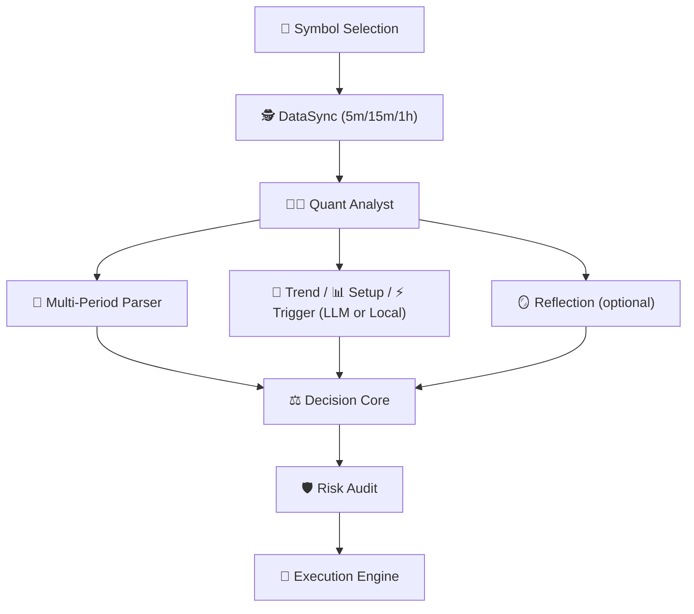

# 🤖 LLM-TradeBot

[](README.md) [](README_CN.md)


Intelligent Multi-Agent Quantitative Trading Bot based on the **Adversarial Decision Framework (ADF)**. Achieves high win rates and low drawdown in automated futures trading through market regime detection, price position awareness, dynamic score calibration, and multi-layer physical auditing.

[](https://www.python.org/)
[](LICENSE)
[](https://github.com/Mustyhabib/LLM-TradeBot)

---

## 🌐 Web Online Version (Recommended)

**No deployment needed, monitor and manage your bot directly through the web interface:**
**[👉 Visit Live Dashboard](https://llm-tradebot.up.railway.app/)**

### Dashboard Highlights

- **LLM toggle** is off by default; turning it on prompts for an API Key.
- **Agent Chatroom** displays each cycle's agent outputs and final decisions in chat format.
- **Real-time balance curve** uses a fixed initial balance, updated based on order PnL.
- **Agent Config** supports editing per-agent parameters and (optional) system prompts.

---

## ✨ Core Features

- 🕵️ **Perception First**: Unlike conventional indicator-based systems, the system prioritizes judging "IF we should trade" before deciding "HOW to trade".
- 🤖 **Multi-Agent Collaboration**: Core + optional agent combinations, supporting LLM and Local dual-mode deployment.
- 🎛️ **Agent Configuration**: Enable/disable optional agents via Dashboard, environment variables, or config file for customized strategies.
- 💬 **Agent Chatroom**: Chat-style multi-agent output per cycle, aggregated by Decision Core for final decisioning.
- 🧩 **Agent Config Panel**: Configure per-agent parameters and system prompts directly in the Dashboard.
- 🎰 **AUTO1 Smart Symbol Selection**: Automatically selects the best single trading symbol based on momentum, volume, and technical indicators.
- 🧠 **Multi-LLM Support**: Seamlessly switch between DeepSeek, OpenAI, Claude, Qwen, Gemini, and other LLMs.
- ⚡ **Async Concurrency**: Concurrently fetches multi-timeframe data, ensuring 5m/15m/1h data alignment at the snapshot moment.
- 🧪💰 **Test/Live Mode Toggle**: Quickly switch between paper trading and live trading with visual confirmation.
- 🛡️ **Safety First**: Stop-loss direction correction, capital pre-rehearsal, and single-veto mechanism to safeguard live trading.
- 📊 **Full-Link Auditing**: Every decision's adversarial process and confidence penalty details are fully recorded, achieving true "white-box" decision-making.

---

## 🤝 Supported Ecosystem

### Supported Exchanges

#### CEX (Centralized Exchanges)

| Exchange | Status | Register (Fee Discount) |
|----------|--------|-------------------------|
| **Binance** | ✅ Supported | [Register](https://www.binance.com/join?ref=NOFXENG) |
| **Bybit** | 🗓️ Coming Soon | [Register](https://partner.bybit.com/b/83856) |
| **OKX** | 🗓️ Coming Soon | [Register](https://www.okx.com/join/1865360) |
| **Bitget** | 🗓️ Coming Soon | [Register](https://www.bitget.com/referral/register?from=referral&clacCode=c8a43172) |

#### Perp-DEX (Decentralized Perpetual Exchanges)

| Exchange | Status | Register (Fee Discount) |
|----------|--------|-------------------------|
| **Hyperliquid** | 🗓️ Coming Soon | [Register](https://app.hyperliquid.xyz/join/AITRADING) |
| **Aster DEX** | 🗓️ Coming Soon | [Register](https://www.asterdex.com/en/referral/fdfc0e) |
| **Lighter** | 🗓️ Coming Soon | [Register](https://app.lighter.xyz/?referral=68151432) |

### Supported AI Models

| AI Model | Status | Get API Key |
|----------|--------|-------------|
| **DeepSeek** | ✅ Supported | [Get API Key](https://platform.deepseek.com) |
| **Qwen** | ✅ Supported | [Get API Key](https://dashscope.console.aliyun.com) |
| **OpenAI (GPT)** | ✅ Supported | [Get API Key](https://platform.openai.com) |
| **Claude** | ✅ Supported | [Get API Key](https://console.anthropic.com) |
| **Gemini** | ✅ Supported | [Get API Key](https://aistudio.google.com) |
| **Grok** | 🗓️ Coming Soon | [Get API Key](https://console.x.ai) |
| **Kimi** | 🗓️ Coming Soon | [Get API Key](https://platform.moonshot.cn) |

---

## 🚀 Quick Start

### Detailed Steps

#### 1. Install Dependencies

```bash
pip install -r requirements.txt
```

#### 2. Configure Environment

```bash
# Copy environment variable template
cp .env.example .env

# Set API keys
./set_api_keys.sh
```

#### 3. Configure Trading Parameters

```bash
# Copy config template
cp config.example.yaml config.yaml
```

Edit `config.yaml` to set trading parameters:

- Trading pair (symbol)
- Max position size (max_position_size)
- Leverage (leverage)
- Stop loss/Take profit % (stop_loss_pct, take_profit_pct)

### 🧠 LLM Configuration (Multi-Provider Support)

This bot supports **8 LLM providers**, configurable via environment variables or Dashboard settings:

#### Supported Providers

| Provider | Model | Cost | Speed | Get API Key |
|----------|-------|------|-------|-------------|
| **DeepSeek** (Recommended) | deepseek-chat | 💰 Low | ⚡ Fast | [platform.deepseek.com](https://platform.deepseek.com) |
| **OpenAI** | gpt-4o, gpt-4o-mini | 💰💰💰 High | ⚡ Fast | [platform.openai.com](https://platform.openai.com) |
| **Claude** | claude-3-5-sonnet | 💰💰 Medium | ⚡ Fast | [console.anthropic.com](https://console.anthropic.com) |
| **Qwen** | qwen-turbo, qwen-plus | 💰 Low | ⚡ Fast | [dashscope.console.aliyun.com](https://dashscope.console.aliyun.com) |
| **Gemini** | gemini-1.5-pro | 💰 Low | ⚡ Fast | [aistudio.google.com](https://aistudio.google.com) |
| **Kimi** | moonshot-v1-8k | 💰 Low | ⚡ Fast | [platform.moonshot.ai](https://platform.moonshot.ai) |
| **MiniMax** | MiniMax-M2.1 | 💰 Low | ⚡ Fast | [platform.minimax.io](https://platform.minimax.io) |
| **GLM** | glm-4-flash | 💰 Low | ⚡ Fast | [open.bigmodel.cn](https://open.bigmodel.cn) |

#### Configuration Methods

**Method 1: Environment Variables** (Recommended)

Edit `.env` file:

```bash
# Select LLM provider (required)
LLM_PROVIDER=deepseek  # Options: deepseek, openai, claude, qwen, gemini, kimi, minimax, glm

# Configure API key for selected provider
DEEPSEEK_API_KEY=sk-xxx     # when using DeepSeek
OPENAI_API_KEY=sk-xxx       # when using OpenAI
CLAUDE_API_KEY=sk-xxx       # when using Claude
QWEN_API_KEY=sk-xxx         # when using Qwen
GEMINI_API_KEY=xxx          # when using Gemini
KIMI_API_KEY=sk-xxx         # when using Kimi
MINIMAX_API_KEY=sk-xxx      # when using MiniMax
GLM_API_KEY=sk-xxx          # when using GLM
```

**Method 2: Dashboard Settings**

1. Open Dashboard at `http://localhost:8000`
2. Click **⚙️ Settings** → **API Keys** tab
3. Select LLM provider and enter API Key
4. Click **Save** - takes effect on next trading cycle

#### 4. Start Web Dashboard (Recommended)


This project includes a modern real-time monitoring dashboard (Web Dashboard).

```bash
# Start main program (auto-starts Web service)
python main.py --mode continuous
```

After startup, visit in browser: **<http://localhost:8000>** (or use our [Cloud Hosted Version](https://llm-tradebot.up.railway.app/))

> **Default password**: `admin`

**Dashboard Features**:

- **🧪💰 Test/Live Mode Toggle**: Quickly switch between paper trading and live trading with visual confirmation
- **📈 K-Line Chart**: TradingView lightweight chart integration, real-time K-line updates, auto-sync with current trading symbol
- **💰 Account Summary Panel**: Real-time display of wallet balance, available balance, equity, initial capital, PnL, and position details
- **🤖 Multi-Agent Decision Framework**: Visual flowchart showing 15 agents in layered architecture
- **🎛️ Agent Selection Panel**: Configure optional agents via Settings → Agents tab
- **📡 Agent Activity Subscription**: Real-time event stream showing agent status updates
- **📜 Trade History**: All trade records and PnL statistics
- **📋 Real-time Log Output**: Real-time scrolling logs, agent documentation sidebar, simplified/detailed mode toggle

#### 5. Simplified CLI Mode (Live Trading)

**For production live trading**, it is recommended to use the simplified CLI script, skipping non-essential components:

```bash
# First activate virtual environment
source venv/bin/activate

# Test mode - single run
python simple_cli.py --mode once

# Test mode - continuous (3-minute intervals)
python simple_cli.py --mode continuous --interval 3

# Live mode - continuous trading (⚠️ REAL MONEY)
python simple_cli.py --mode continuous --interval 3 --live

# Custom symbols (overrides .env config)
python simple_cli.py --mode continuous --symbols BTCUSDT,ETHUSDT --live

# AUTO3 mode - automatic symbol selection
python simple_cli.py --mode continuous --symbols AUTO3 --live
```

**Features**:

- ✅ **Minimal footprint** - only loads core trading components
- ✅ **Production-ready** - designed for stable 24/7 operation
- ✅ **AUTO3 support** - automatic best symbol selection based on backtest
- ✅ **LLM integration** - complete multi-agent decision system
- ✅ **Risk management** - built-in risk audit and position limits
- ✅ **Graceful shutdown** - Ctrl+C for safe exit

**Configuration**:

The script reads trading symbols from `.env` file by default:

```bash
# Configure in .env file
TRADING_SYMBOLS=BTCUSDT,ETHUSDT
# Or use AUTO3 for automatic selection
TRADING_SYMBOLS=AUTO3
```

**⚠️ Live Trading Prerequisites**:

- Valid Binance Futures API keys configured in `.env`
- Sufficient USDT balance in Futures wallet
- API permissions: Read + Futures Trading enabled
- DeepSeek/OpenAI API key for LLM decisions

---

## 📁 Project Structure

### Directory Description

```text
LLM-TradeBot/
├── src/                    # Core source code
│   ├── agents/            # Multi-Agent definitions (DataSync, Quant, Decision, Risk)
│   ├── api/               # Binance API client
│   ├── data/              # Data processing module (processor, validator)
│   ├── execution/         # Trade execution engine
│   ├── features/          # Feature engineering module
│   ├── monitoring/        # Monitoring and logging
│   ├── risk/              # Risk management
│   ├── strategy/          # LLM decision engine
│   └── utils/             # Utilities (DataSaver, TradeLogger, etc.)
│
├── docs/                  # Project documentation
│   ├── data_flow_analysis.md          # Data flow analysis document
│   ├── ScreenShot_2026-01-21_003126_160.png # Dashboard screenshot
│   └── Backtesting.png                # Backtesting UI
│
├── data/                  # Structured data storage (archived by date)
│   ├── market_data/       # Raw K-line data
│   ├── indicators/        # Technical indicators
│   ├── features/          # Feature snapshots
│   ├── decisions/         # Decision results
│   └── execution/         # Execution records
│
├── logs/                  # System runtime logs
├── tests/                 # Unit tests
├── config/                # Configuration files
│
├── main.py                # Unified entry point (Multi-Agent loop)
├── config.yaml            # Trading parameters config
├── .env                   # API key config
└── requirements.txt       # Python dependencies
```

---

## 🎯 Core Architecture

### Multi-Agent Collaboration + Four-Layer Strategy Filter



**Design Highlights**
1. **Symbol Selection** determines the trading target before analysis.
2. **DataSync** aligns 5m/15m/1h multi-timeframe data snapshots.
3. **Quant Analyst** outputs trend/oscillator/sentiment/trap numeric signals.
4. **Semantic Agents** (Trend/Setup/Trigger) provide human-readable conclusions (LLM or Local).
5. **Multi-Period Parser** compresses alignment info into decision input.
6. **Decision Core** fuses all enabled agent outputs and gives action/confidence.
7. **Risk Audit** can veto or adjust.
8. **Reflection** summarizes trade performance for future reference.

> 📖 **Detailed Docs**: See [Data Flow Analysis](./docs/data_flow_analysis.md) for complete data flow mechanisms.

## 📄 Full-Link Data Auditing

### Storage Organization

The system automatically records intermediate processes for each cycle in the `data/` directory, organized by date for easy review and debugging:

```text
data/
├── market_data/           # Raw multi-timeframe K-lines
│   └── {date}/
│       ├── BTCUSDT_5m_{timestamp}.json
│       ├── BTCUSDT_5m_{timestamp}.csv
│       ├── BTCUSDT_5m_{timestamp}.parquet
│       ├── BTCUSDT_15m_{timestamp}.json
│       └── BTCUSDT_1h_{timestamp}.json
│
├── indicators/            # Full technical indicator DataFrames
│   └── {date}/
│       ├── BTCUSDT_5m_{snapshot_id}.parquet
│       ├── BTCUSDT_15m_{snapshot_id}.parquet
│       └── BTCUSDT_1h_{snapshot_id}.parquet
│
├── features/              # Extracted feature snapshots
│   └── {date}/
│       ├── BTCUSDT_5m_{snapshot_id}_v1.parquet
│       ├── BTCUSDT_15m_{snapshot_id}_v1.parquet
│       └── BTCUSDT_1h_{snapshot_id}_v1.parquet
│
├── context/               # Quant analysis summary
│   └── {date}/
│       └── BTCUSDT_quant_analysis_{snapshot_id}.json
│
├── llm_logs/              # LLM input context and voting process
│   └── {date}/
│       └── BTCUSDT_{snapshot_id}.md
│
├── decisions/             # Final weighted vote results
│   └── {date}/
│       └── BTCUSDT_{snapshot_id}.json
│
└── execution/             # Execution tracking
    └── {date}/
        └── BTCUSDT_{timestamp}.json
```

### Data Formats

- **JSON**: Human-readable, used for config and decision results
- **CSV**: High compatibility, easy to import into Excel
- **Parquet**: Efficient compression, used for large-scale time-series data

---

## 🛡️ Safety Warning

⚠️ **Important Safety Measures**:

1. **API Keys**: Keep them safe, do NOT commit to version control
2. **Test Mode First**: Use `--test` to run simulated trading, verify logic before going live
3. **Risk Control**: Set reasonable stop-loss and position limits in `config.yaml`
4. **Minimal Permissions**: Only grant necessary Futures Trading permissions to API keys
5. **Monitoring & Alerts**: Regularly check `logs/` directory for anomalies

---

## 📚 Documentation Navigation

| Document | Description |
|------|------|
| [README.md](./README.md) | Project overview and quick start |
| [Data Flow Analysis](./docs/data_flow_analysis.md) | Complete data flow mechanisms and technical details |
| [API Key Guide](./docs/API_KEYS_GUIDE.txt) | API key configuration guide |
| [Config Example](./config.example.yaml) | Trading parameters config template |
| [Env Example](./.env.example) | Environment variables config template |

---

## 🎉 Latest Updates

**2026-02-07**:

- ✅ **Multi-Agent Chatroom**: Per-cycle agent outputs with final Decision Core action.
- ✅ **Agent Config Tabs**: Per-agent parameters + optional system prompts.
- ✅ **LLM Toggle (default off)**: Only enabled after API Key is entered.
- ✅ **Multi-Period Parser**: 1h/15m/5m alignment summary input to Decision Core.
- ✅ **Balance/PnL Fix**: Initial balance fixed, current balance driven by PnL.

**2026-01-07**:

- ✅ **AUTO3 Dynamic Symbol Selection System**: Added `SymbolSelectorAgent` for automatic best trading symbol selection.
  - Fetches AI500 Top 5 symbols by 24h volume
  - Runs 24h backtest for each symbol
  - Ranks by composite score: Return (30%) + Sharpe Ratio (20%) + Win Rate (25%) + Drawdown (15%) + Trade Frequency (10%)
  - Auto-selects Top 2 best performers, 12-hour cache auto-refresh
- ✅ **Backtest/Live Environment Consistency**: `BacktestAgentRunner` fully matches live trading environment.
  - Risk Audit Agent integrated into backtest flow
  - Four-Layer Strategy Filter enabled in backtests
  - Position analysis and market regime detection enabled
- ✅ **Enhanced Backtest CLI**: `python backtest.py` supports:
  - Multi-symbol backtesting
  - Agent strategy mode (`--strategy-mode agent`)
  - LLM enhancement option (`--use-llm`)
  - Detailed HTML reports and equity curves

**2025-12-31**:

- ✅ **Full Chinese Internationalization (i18n)**: Complete bilingual support with one-click language toggle.

**2025-12-28**:

- ✅ **Dashboard Log Mode Toggle**: Supports simplified and detailed mode switching.
- ✅ **Net Value Curve Enhancement**: Smart x-axis labels adapt to data volume.

**2025-12-25**:

- ✅ **ReflectionAgent (The Philosopher)**: New trade reflection agent, analyzes every 10 trades and provides improvement suggestions.

**2025-12-24**:

- ✅ **Multi-LLM Support**: Added 8 LLM provider support (DeepSeek, OpenAI, Claude, Qwen, Gemini, Kimi, MiniMax, GLM).
- ✅ **Multi-Account Architecture**: Added `src/exchanges/` module supporting multi-exchange accounts.

**2025-12-20**:

- ✅ **Adversarial Decision Framework**: Introduced `PositionAnalyzer` and `RegimeDetector` for environment-aware adversarial decisions.
- ✅ **Confidence Score Refactor**: Implemented dynamic confidence penalty mechanism, significantly reducing false opening rate in choppy markets.
- ✅ **Full-Link Auditing**: Implemented complete intermediate state archiving from data collection to decision execution.

---

## 🤝 Contribution

Issues and Pull Requests are welcome!

---

This project is licensed under the MIT License. See the [LICENSE](LICENSE) file for details.

---

**Empowered by AI, Focused on Precision Decision-Making, Starting a New Journey in Intelligent Quantitative Trading!** 🚀
